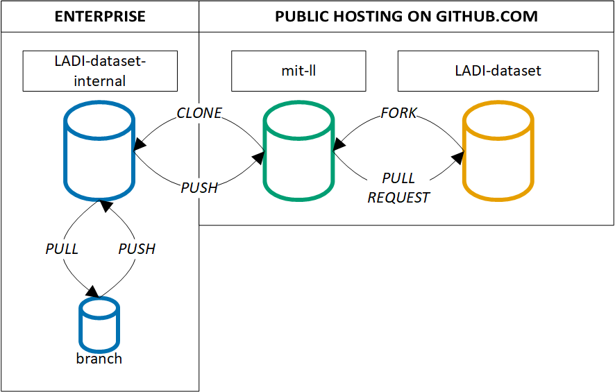
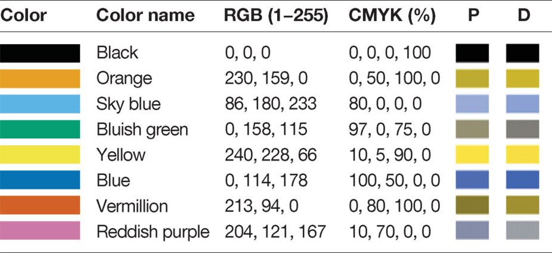

# How to contribute

We encourage the use of the [GitHub Issues](https://guides.github.com/features/issues/) for bug report, new feature requests, etc. To streamline reporting, issues will only be enabled for the [ladi-overview](https://github.com/LADI-Dataset/ladi-overview) repository.

Due to the encounter models routine use in aviation research, we like to minimize the risk of inadvertent bugs or software challenges to maintain the encounter models as a trusted benchmark. To encourage traceability, development should occur via [forking](https://guides.github.com/activities/forking/).

- [How to contribute](#how-to-contribute)
  - [Code of Conduct](#code-of-conduct)
  - [Roadmap](#roadmap)
  - [Workflow](#workflow)
  - [Annotation Requests](#annotation-requests)
    - [Requesting Additional Annotations](#requesting-additional-annotations)
  - [Bugs](#bugs)
    - [Reporting Bugs](#reporting-bugs)
    - [Patching Bugs](#patching-bugs)
    - [Cosmetic Patch](#cosmetic-patch)
  - [Enhancements and New Features](#enhancements-and-new-features)
    - [Requesting features](#requesting-features)
    - [Developing features](#developing-features)
    - [Requesting documentation](#requesting-documentation)
  - [Convention Guide](#convention-guide)
    - [Character Encoding](#character-encoding)
    - [Documentation](#documentation)
    - [End of Line](#end-of-line)
    - [System Environment Variables](#system-environment-variables)
    - [Variable Names](#variable-names)
    - [Units](#units)
    - [Colors](#colors)
  - [Questions about the source code](#questions-about-the-source-code)
  - [Distribution Statement](#distribution-statement)

## Code of Conduct

This project and everyone participating in it is governed by the [Code of Conduct](CODE_OF_CONDUCT.md). By participating, you are expected to uphold this code. Please report unacceptable behavior to [ladi-dataset-admin@mit.edu](mailto:ladi-dataset-admin@mit.edu).

## Roadmap

No public technology roadmap for development is available yet. As a community forms around the dataset, this may change.

## Workflow

A variety of organizations from academia, federal agencies, federal funded research and development centers (FFRDC), and industry have supported encounter model development. Each organization has different policies on release review and procedures to disseminate content. Organizations may also have their own enterprise self-hosted version control systems.

We recommend the following workflow that perseveres content part of the [LADI-Dataset](https://github.com/LADI-Dataset) organization as a "gold benchmark" while promoting a traceable workflow for contributors.



We'll use an illustrative example with MIT Lincoln Laboratory, a FFRDC with strict release review policies, with their public [mit-ll](https://github.com/mit-ll) organization and a private enterprise system to explain this workflow. For organizations that permit public development, ignore steps with the enterprise instance.

1. The repository required for development is identified in[LADI-Dataset](https://github.com/LADI-Dataset)
2. This repository is forked by the [mit-ll](https://github.com/mit-ll) organization.
3. The new repository on [mit-ll](https://github.com/mit-ll) organization is cloned by the enterprise self-hosted GitHub. Note you can't fork from public to private, see this Stack Overflow question for mitigations: [Is it possible to fork a public GitHub repo into an enterprise repository?](https://stackoverflow.com/q/29952033)
- Prior to any changes, there are now three instances of the repository: a private enterprise clone (airspace-encounter-models-internal), a public fork ([mit-ll](https://github.com/mit-ll)), and the original ([LADI-Dataset](https://github.com/LADI-Dataset)).
4. Development is conducted using branches on the enterprise clone.
5. When development is over, the clone will be released review according to internal policies.
6. Once the clone is approved for public release, changes will be pushed to the public fork.
7. A pull request will be opened to contribute back to the original.
8. The encounter model administrators will review the pull request and either accept or reject it.

## Annotation Requests

We're interested in growing the dataset via contributions from other organizations or research efforts. For annotations generated by humans, contributions need to demonstrate that human workers are as qualified as those used for the development of LADI version 1. Refer to the [crowdsourced human annotations](#crowdsourced-human-annotations) section and contact the administrators at [ladi-dataset-admin@mit.edu](mailto:ladi-dataset-admin@mit.edu) for more details.

### Requesting Additional Annotations

- **Ensure the annotation was not already requested** by searching on GitHub under [Issues](https://github.com/airspace-encounter-models/em-overview/issues). This is particularly important if annotations are requested for the same incident.
- If you're unable to find an open issue addressing the problem, [open a new one](https://github.com/airspace-encounter-models/em-overview/issues) using the [annotation request](.github/ISSUE_TEMPLATE/annotation_request.md) template. Be sure to include a title, a clear description, and as much relevant information as possible.

## Bugs

According to [Wikipedia](https://en.wikipedia.org/wiki/Software_bug), a software bug is a:
> A software bug is an error, flaw, failure or fault in a computer program or system that causes it to produce an incorrect or unexpected result, or to behave in unintended ways.

### Reporting Bugs

- **Ensure the bug was not already reported** by searching on GitHub under [Issues](https://github.com/airspace-encounter-models/em-overview/issues).
- If you're unable to find an open issue addressing the problem, [open a new one](https://github.com/airspace-encounter-models/em-overview/issues) using the [bug report](.github/ISSUE_TEMPLATE/bug_report.md) template. Be sure to include a title, a clear description, and as much relevant information as possible.
- Confirm that the bug report template assigned a BUG label to the issue.

### Patching Bugs

- Open a new GitHub pull request with the patch.
- Ensure the pull request description clearly describes the problem and solution. Include the relevant issue number if applicable.
- Before submitting, please read the [convention guide](#convention-guide) to know more about coding conventions and recommended units.

### Cosmetic Patch

Changes that are cosmetic in nature, such as fixing whitespaces characters or formatting code, and do not add anything substantial to the stability, functionality, or testability will generally not be accepted. Our rational aligns with those expressed by the [Ruby on Rails team](https://github.com/rails/rails/pull/13771#issuecomment-32746700).

## Enhancements and New Features

According to [Wikipedia](https://en.wikipedia.org/wiki/Software_feature) and IEEE 829, a software feature is a:
> A distinguishing characteristic of a software item (e.g., performance, portability, or functionality.

### Requesting features

- **Ensure the feature was not already requested** by searching on GitHub under [Issues](https://github.com/airspace-encounter-models/em-overview/issues).
- If you're unable to find an open issue for the desired feature, [open a new one](https://github.com/airspace-encounter-models/em-overview/issues) using the [feature request](.github/ISSUE_TEMPLATE/feature_request.md) template. Be sure to include a title, a clear description, and as much relevant information as possible.
- Confirm that the feature request template assigned an ENHANCEMENT label to the issue.

### Developing features

- Fork the repository associated with the feature request and develop the desired capabilities
- Open a new GitHub pull request with the enhancement
- Ensure the pull request description clearly addresses the feature request. Include the relevant issue number. Unlike bugs, enhancements without a traceable issue number will not have the pull request accepted.
- Before submitting, please read the [convention guide](#convention-guide) to know more about coding conventions and recommended units. Some documentation and code commenting is required for the pull request to be accepted too.

### Requesting documentation

Requesting more or a clarification of documentation is a valid feature request. Note as a community development project, it would be nearly impossible to enforce authors of a specific piece of code to respond to the documentation request.

## Convention Guide

### Character Encoding

To facilitate cross-platform compatibility, please use UTF-8 or ASCII. Note that UTF-8 is backwards compatible with ASCII.

### Documentation

**Pull requests with no documentation will be rejected.** We believe documentation is good and integral to the success of a community software project. However, we recognize that everyone has different expectations and opinions on code documentation. [Self-documenting code](https://en.wikipedia.org/wiki/Self-documenting_code) should be sufficient in most cases but the use of inline comments to organize blocks of code are encouraged.

### End of Line

To facilitate cross-platform compatibility, please use unix style line endings of `LF (\n)`. For three popular text editors, here are instructions on how to enable `LF` endings.

- [Atom: Line Ending Selector Package](https://github.com/atom/atom/tree/master/packages/line-ending-selector)
- [Notepad++: Preferences](https://stackoverflow.com/q/8195839)
- [VS Code: User Preferences](https://stackoverflow.com/q/52404044)

### System Environment Variables

Persistent system environment variables are used to when referencing across and within repositories. They should follow a naming convention of `LADI_TYPE_DESCRIPTION`.

- Persistent system variables should be written using all capital letters
- Strings should be delimitated by an underscore, `_`
- A prefix of `LADI` should always be used for software within this organization
- The second string should describe what the variable references. Use `DIR` for directories; `FILE` for files; and `SCRIPT` for shell scripts.
- The third string should provide additional descriptive information.

### Variable Names

- When applicable, variable names should include units, such as `speed_kt` or `el_ft_msl`. 
- Delimiter-separated words should use an underscore, `_`
- Variable names should be short yet meaningful. The choice of a variable name should be mnemonic — that is, designed to indicate to the casual observer the intent of its use. One-character variable names should be avoided except for temporary "throwaway" variables. Common names for temporary variables are `i`, `j`, `k`.

### Units

We recommend the use of metric units. We strongly recommend converting, if appropriate, to these units as soon as possible when reading in data. We discourage converting to a different units within stand alone functions or as part of intermediate code.

Dimension | Unit
------------ | -------------
time | [second (s)](https://en.wikipedia.org/wiki/Second)
length - altitude & elevation | [meter (m)](https://en.wikipedia.org/wiki/Metre)
length - longitudinal and lateral distance | [meter (m)](https://en.wikipedia.org/wiki/Metre)
speed - vertical rate | meters per second (mps)
speed - airspeed or ground speed | meters per second (mps)
plane angle - course, heading, roll, pitch, yaw | [degree (deg)](https://en.wikipedia.org/wiki/Degree_(angle))
latitude & longitude coordinates | [decimal degrees (DD)](https://en.wikipedia.org/wiki/Decimal_degrees)
world geodetic system | [WGS 84 (EPSG:4326)](https://epsg.io/4326)
temperature | [degree Celsius (°C)](https://en.wikipedia.org/wiki/Celsius)
digital information | [Megabyte (MB)](https://en.wikipedia.org/wiki/Megabyte)

### Colors

To promote accessibility and align with graphic best practices, we recommend a color guidelines proposed by B. Wong that is perceived as reasonably distinct by both normal and color blind individuals. Selecting a widely perceived color scheme is particularly important for peer reviews, as B. Wong notes:

> If a submitted manuscript happens to go to three male reviewers of Northern European descent, the chance that at least one will be color blind is 22 percent...The palette of eight colors shown [below] has good overall variability and can be differentiated by individuals with red-green color blindness.



<details> <summary> B. Wong, “Points of view: Color blindness,” Nature Methods, vol. 8, pp. 441–441, May 2011.</summary>
<p>

```tex
@article{wongPointsViewColor2011,
	title = {Points of view: {Color} blindness},
	volume = {8},
	copyright = {2011 Nature Publishing Group},
	issn = {1548-7105},
	shorttitle = {Points of view},
	url = {https://www.nature.com/articles/nmeth.1618},
	doi = {10.1038/nmeth.1618},
	language = {en},
	urldate = {2019-08-27},
	journal = {Nature Methods},
	author = {Wong, Bang},
	month = may,
	year = {2011},
	pages = {441--441},
	}
```
</p>
</details>

## Questions about the source code

Please contact the administrators at [ladi-dataset-admin@mit.edu](mailto:ladi-dataset-admin@mit.edu). As the encounter models transition to a more community driven effort, a separate mailing list for code discussion may be created.

## Distribution Statement

This work was performed under the following financial assistance award 70NANB17Hl69 from U.S. Department of Commerce, National Institute of Standards and Technology

DISTRIBUTION STATEMENT A. Approved for public release. Distribution is unlimited.

Delivered to the U.S. Government with Unlimited Rights, as defined in DFARS Part 252.227-7013 or 7014 (Feb 2014). Notwithstanding any copyright notice, U.S. Government rights in this work are defined by DFARS 252.227-7013 or DFARS 252.227-7014 as detailed above. Use of this work other than as specifically authorized by the U.S. Government may violate any copyrights that exist in this work.
