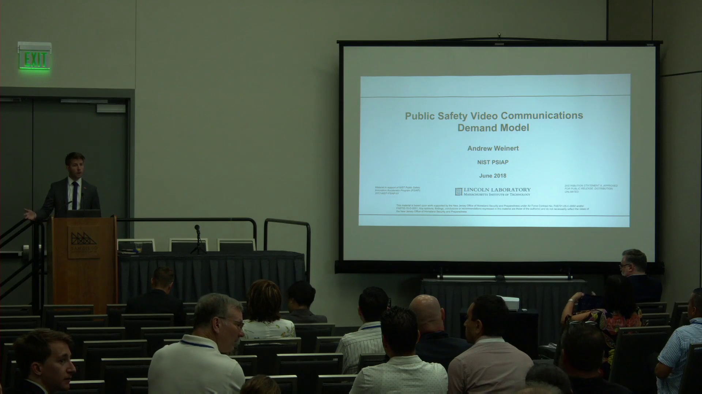

# Low Altitude Disaster Imagery (LADI) Dataset

Computer vision capabilities have rapidly been advancing and are expected to become an important component to incident and disaster response. However, the majority of computer vision capabilities are not meeting public safety’s needs, such as support for search and rescue, due to the lack of appropriate training data and requirements. For example in 2019, a leading computer vision benchmark has mislabeled a flooded region as a “toilet,” or a highway surrounded by flooding as a “runway.” In response, we’ve developed a dataset of images collected by the Civil Air Patrol of various disasters. The raw images were previously released into the public domain. Two key distinctions are the low altitude, oblique perspective of the imagery and disaster-related features, which are rarely featured in computer vision benchmarks and datasets. A subset of images were annotated using Amazon MTurk and high confidence results were achieved by consensus of qualified workers, who were evaluated on their ability to recognize objects via a qualification test. The dataset currently employs a hierarchical labeling scheme of a five coarse categorical and then more specific annotations for each category. The initial dataset focuses on the Atlantic Hurricane and spring flooding seasons since 2015. We also provide annotations produced from the commercial Google Cloud Vision service and open source Places365 benchmark.

- [Low Altitude Disaster Imagery (LADI) Dataset](#low-altitude-disaster-imagery-ladi-dataset)
	- [Point of Contact](#point-of-contact)
	- [Contributing to the Dataset](#contributing-to-the-dataset)
	- [Nomenclature](#nomenclature)
	- [Video Presentations and Overviews](#video-presentations-and-overviews)
		- [Introductory Video](#introductory-video)
		- [Technical Overview](#technical-overview)
		- [Preliminary Conclusions Based on End-User Outreach](#preliminary-conclusions-based-on-end-user-outreach)
		- [How CAP Collected the Imagery](#how-cap-collected-the-imagery)
	- [Dataset Access](#dataset-access)
		- [Dataset Organization](#dataset-organization)
		- [Metadata and Annotation Database](#metadata-and-annotation-database)
		- [Additional Details](#additional-details)
		- [YAML Tags](#yaml-tags)
	- [Dataset Annotations](#dataset-annotations)
		- [Selecting Labels in Partnership with Public Safety](#selecting-labels-in-partnership-with-public-safety)
		- [Hierarchical Labeling Scheme](#hierarchical-labeling-scheme)
		- [Example Source Imagery](#example-source-imagery)
		- [Crowdsourced Human Annotations](#crowdsourced-human-annotations)
		- [Benchmark Machine Annotations](#benchmark-machine-annotations)
		- [Metadata](#metadata)
		- [Machine Learning as a Service](#machine-learning-as-a-service)
	- [Dataset Scope](#dataset-scope)
	- [Dataset Use](#dataset-use)
		- [Motivation](#motivation)
		- [Proposed Tasks](#proposed-tasks)
			- [Scene Description and Indexing](#scene-description-and-indexing)
			- [Geo-Localization and Object Detection](#geo-localization-and-object-detection)
			- [Cross-View and Heterogenous Observations](#cross-view-and-heterogenous-observations)
		- [Disaster Scene Description and Indexing](#disaster-scene-description-and-indexing)
	- [Task Resources](#task-resources)
		- [Task Coordinators](#task-coordinators)
		- [System Task](#system-task)
			- [Main Task](#main-task)
			- [Progress Subtask](#progress-subtask)
		- [Data Resources](#data-resources)
			- [Development Dataset](#development-dataset)
			- [Testing Dataset](#testing-dataset)
			- [Auxiliary Resources](#auxiliary-resources)
				- [Benchmarks](#benchmarks)
				- [Infrastructure](#infrastructure)
				- [Satellite / Overhead Imagery](#satellite--overhead-imagery)
		- [Participation types](#participation-types)
		- [Allowed training categories](#allowed-training-categories)
		- [Run Submission Types](#run-submission-types)
		- [Evaluation](#evaluation)
		- [Measures](#measures)
		- [Open Issues](#open-issues)
	- [Frequently Asked Questions (FAQ)](#frequently-asked-questions-faq)
		- [Access and Use](#access-and-use)
			- [How is this different than the CAP imagery hosted on the FEMA CAP Browser or on the FEMA S3?](#how-is-this-different-than-the-cap-imagery-hosted-on-the-fema-cap-browser-or-on-the-fema-s3)
			- [Does FEMA host all the imagery CAP collects?](#does-fema-host-all-the-imagery-cap-collects)
			- [Does FEMA or CAP know you are doing this?](#does-fema-or-cap-know-you-are-doing-this)
			- [Did you have humans annotate all the CAP images hosted by FEMA?](#did-you-have-humans-annotate-all-the-cap-images-hosted-by-fema)
			- [Is this considered human subject research and subject to COUHES?](#is-this-considered-human-subject-research-and-subject-to-couhes)
			- [Can I commercially build upon the dataset?](#can-i-commercially-build-upon-the-dataset)
			- [What is a good academic venue to publish results?](#what-is-a-good-academic-venue-to-publish-results)
		- [Content](#content)
			- [Are human faces censored or blurred out?](#are-human-faces-censored-or-blurred-out)
			- [Are there potentially graphic or mature imagery?](#are-there-potentially-graphic-or-mature-imagery)
			- [Is all the imagery of the United States and its territories?](#is-all-the-imagery-of-the-united-states-and-its-territories)
			- [Do the images share a common lens projection? Do I need to reproject images?](#do-the-images-share-a-common-lens-projection-do-i-need-to-reproject-images)
			- [Were any of the images collected using drones?](#were-any-of-the-images-collected-using-drones)
	- [Related Content](#related-content)
	- [Citation](#citation)
	- [Distribution Statement](#distribution-statement)

## Point of Contact

We encourage the use of the [GitHub Issues](https://guides.github.com/features/issues/) but when email is required, please contact the administrators at [ladi-dataset-admin@mit.edu](mailto:ladi-dataset-admin@mit.edu). As the public safety and computer vision communities adopt the dataset, a separate mailing list for development may be created.

## Contributing to the Dataset

If you're a member of the public safety or disaster response community, we're particularly interested in your feedback and recommendation for future annotation tasks to grow the dataset.

We encourage the use of the [GitHub Issues](https://guides.github.com/features/issues/) for annotation requests, feature requests, bug reports, etc. To streamline reporting, issues will only be enabled for the [ladi-overview](https://github.com/LADI-Dataset/ladi-overview) repository. Refer to the [contributing guidelines](CONTRIBUTING.md) for more details.

We're interested in growing the dataset via contributions from other organizations or research efforts. For annotations generated by humans, contributions need to demonstrate that human workers are as qualified as those used for the development of LADI version 1. Refer to the [crowdsourced human annotations](#crowdsourced-human-annotations) section and contact the administrators at [ladi-dataset-admin@mit.edu](mailto:ladi-dataset-admin@mit.edu) for more details.

## Nomenclature

Acronym | Phrase
 :--- | :---
AWS | [Amazon Web Services](https://aws.amazon.com/)
CAP | [Civil Air Patrol](https://www.gocivilairpatrol.com/)
CART | County Animal Response Team
FEMA | [Federal Emergency Management Agency](https://www.fema.gov/)
HIT | Human Intelligence Task
LE | Law Enforcement
LTC | Long Term Care
MIT LL | [Massachusetts Institute of Technology Lincoln Laboratory](https://www.ll.mit.edu/)
MTurk | [Mechanical Turk](https://www.mturk.com/)
NJOHSP | [New Jersey Office of Homeland Security and Preparedness](https://www.njhomelandsecurity.gov/)
NIST | [National Institute of Standards and Technology](https://www.nist.gov/)
PSAP | Public Safety Answer Point
PSIAP | [Public Safety Innovation Accelerator Program 2017](https://www.nist.gov/ctl/pscr/funding-opportunities/past-funding-opportunities/psiap-2017)
USAR | Urban Search and Rescue

## Video Presentations and Overviews

These videos provide an overview, background, and discussion of the PSIAP and LADI dataset effort. All these videos are suitable for a high-school level or introductory audience. More technical details can be found in peer-reviewed academic publications that are referenced throughout the README.

### Introductory Video

A short five minute video that overviews of the PSIAP dataset effort. It discusses the motivation for the dataset and includes voice-overs from FEMA USAR team members. It also introduces the ground-based video component of the PSIAP dataset and the low altitude airborne imagery component that has been technology transferred as the LADI dataset.

<details> <summary> A. Weinert, “Video and Imagery Dataset to Drive Public Safety Capabilities,” YouTube, 2019
</summary>
<p>

```tex
@misc{weinertYouTube2019,
  title = {Video and {{Imagery Dataset}} to {{Drive Public Safety Capabilities}}},
  author = {Weinert, Andrew},
  url = {https://youtu.be/JZnXr_B0SEw}
  abstract = {MIT Lincoln Laboratory and the New Jersey Office of Homeland Security and Preparedness have been developing a computer vision dataset of operational and representative public safety scenarios. This dataset will enable technology development tailored to public safety scenarios. Along with our collaborators, we generated more than 30 hours of video representative of some public safety scenarios. In total, there are millions of labeled public safety operational and representative images and key video frames. The dataset includes operational images and videos from the Civil Air Patrol (CAP), the Defense Visual Information Distribution Service (DVIDS), Massachusetts Task Force One (MA-TF1), Unmanned Robotics Systems Analysis (URSA), and the United States Geological Survey (USGS).},
  type = {{{YouTube}}},
  language = {en},
  month = aug,
  year = {2019}
}
```
</p>
</details>
<br>

[](https://youtu.be/JZnXr_B0SEw "YouTube: Video and Imagery Dataset to Drive Public Safety Capabilities")

### Technical Overview

A recording of a forty minute presentation from the [2019 Public Safety Broadband Stakeholder Meeting](https://www.nist.gov/ctl/pscr/2019-public-safety-broadband-stakeholder-meeting). The recording includes both the presentation and questions, with LADI-specific discussion starting at 21:54. The discussion emphasizes that the imagery included in the LADI dataset presents a challenge to the general computer vision community. Note that the features of interest, presented on slide 30, were slightly changed prior to the initial release of the LADI dataset. Please refer to [Hierarchical Labeling Scheme](#hierarchical-labeling-scheme) for the current labeling scheme.

<details> <summary> A. Weinert, “Video and Imagery Dataset to Drive Public Safety Capabilities,” in 2019 Public Safety Broadband Stakeholder Meeting, Chicago, IL, 2019.</summary>
<p>

```tex
@inproceedings{weinertDataset2019,
	title = {Video and Imagery Dataset to Drive Public Safety Capabilities},
	url = {https://cdnapisec.kaltura.com/index.php/extwidget/preview/partner_id/684682/uiconf_id/31013851/entry_id/1_tux4px6k/embed/dynamic},
	address = {Chicago, IL, USA},
	language = {en},
	booktitle = {Public Safety Broadband Stakeholder Meeting},
	author = {Weinert, Andrew},
	month = jul,
	year = {2019},
}
```
</p>
</details>
<br>

[](https://cdnapisec.kaltura.com/index.php/extwidget/preview/partner_id/684682/uiconf_id/31013851/entry_id/1_tux4px6k/embed/dynamic "Kaltura: 2019 Public Safety Broadband Stakeholder Meeting")

### Preliminary Conclusions Based on End-User Outreach

A recording of a forty minute presentation from the [2018 Public Safety Broadband Stakeholder Meeting](https://www.nist.gov/ctl/pscr/2018-public-safety-broadband-stakeholder-meeting). It largely focuses on conclusions based on a literature review and outreach with the public safety community. Notably this brief lays out a set of desired common capabilities to support various public safety organizations including animal control, firefighting and, search and rescue, animal control. The capabilities, such as improving incident or threat description, proposed in 2018 were a key consideration when developing and scoping the LADI dataset. Note that this brief states the need for the dataset to represent wide area search scenarios, while the presented examples focus more on ground-based imagery when discussing dataset considerations.

<details> <summary> A. Weinert, “Public Safety Operations Video and Network Traffic Dataset,” in 2018 Public Safety Broadband Stakeholder Meeting, San Diego, CA 2018.</summary>
<p>

```tex
@inproceedings{weinertDataset2019,
	title = {Public Safety Operations Video and Network Traffic Dataset},
	url = {https://www.nist.gov/video/public-safety-operations-video-and-network-traffic-dataset},
	url = {https://cdnapisec.kaltura.com/index.php/extwidget/preview/partner_id/684682/uiconf_id/31013851/entry_id/1_e57j22m4/embed/dynamic},
	address = {San Diego, CA, USA},
	language = {en},
	booktitle = {Public Safety Broadband Stakeholder Meeting},
	author = {Weinert, Andrew},
	month = jun,
	year = {2018},
}
```
</p>
</details>
<br>

[](https://cdnapisec.kaltura.com/index.php/extwidget/preview/partner_id/684682/uiconf_id/31013851/entry_id/1_e57j22m4/embed/dynamic "Kaltura: 2018 Public Safety Broadband Stakeholder Meeting")

### How CAP Collected the Imagery

This short YouTube video was uploaded by CAP to illustrate how they collected imagery for Hurricane Maria. Note that the imagery was collected by humans and often without significant stabilization.
<details> <summary> The Civil Air Patrol National Headquarters, “Civil Air Patrol Flies in Response to Hurricane Maria's Impact on Puerto Rico,” YouTube, 2017
</summary>
<p>

```tex
@misc{capYouTube2017,
  title = {Civil Air Patrol Flies in Response to Hurricane Maria's Impact on Puerto Rico},
  author ={The Civil Air Patrol National Headquarters},
  url = {https://youtu.be/i0-IXoiJrDU},
  type = {{{YouTube}}},
  language = {en},
  month = oct,
  year = {2017}
}
```
</p>
</details>
<br>

[](https://youtu.be/i0-IXoiJrDU "YouTube: Civil Air Patrol Flies in Response to Hurricane Maria's Impact on Puerto Rico")

## Dataset Access

The LADI dataset is stored in the cloud using AWS [object storage service, S3](https://aws.amazon.com/s3/). AWS also provides access to flexible cloud computing resources in the form of [EC2](https://aws.amazon.com/ec2/) instances. Users may want to considering analyzing using an AWS EC2 instance because data transfer will be extremely fast between S3 and EC2 compared to downloading the data to a local machine. An additional benefit of using cloud computing resources for analyses is access to instances with more powerful computing resources than a desktop or laptop. Working with the the LADI dataset can be extremely memory intensive, due to the continuous and discrete variables and the combinatorial potential of the annotations, so these additional cloud resources can significantly speed up analyses.

You can browse and access the dataset from the browser at https://s3.console.aws.amazon.com/s3/buckets/ladi/

For command-line access, you can download specific files using the [AWS CLI](https://aws.amazon.com/cli/):
```
aws s3 cp s3://ladi/path/to/remote path/to/local --recursive
```
where `path/to/remote` should be replaced with the path of the data within the [LADI S3 bucket](https://s3.console.aws.amazon.com/s3/buckets/ladi/) and `path/to/local` represents the local path where the files will be written. The `--recursive` flag specifies that subdirectories should be copied.

To download the entire dataset, use:
```
aws s3 sync s3://ladi/ path/to/local
```
where `path/to/local` again represents the local path where the files will be written.

### Dataset Organization
There are two top-level directories of the LADI dataset:
- Images: contains the raw images
- Labels: contains files with metadata and labels for images in the LADI dataset
	- We include multiple file formats for the same file: items with the same name but different extensions just represent different formats of the same information. You only need the version that is useful for you. 
	- `.pgsql` is a postgresql binary database export, which can be convenient for making queries
	- `.tsv` and `.csv` are tab-separated and comma-separated text files, respectively, and should be compatible with most programs

Within the Labels directory, there are a number of files, described below:
- `ladi_images_metadata` file lists all of the metadata of the FEMA_CAP files in LADI. Fields are:
	- `uuid` – unique ID for each image, constructed from the sha1 hash of the binary image file
	- `timestamp` – local time of when the image was taken
	- `gps_lat`, `gps_lon`, `gps_alt` – GPS latitude, longitude, and altitude of where the image was taken. lat/lon is in decimal degrees, altitude is in meters above sea level
	- `file_size` – size of the image file, in bytes
	- `width`, `height` – dimensions of the image, in pixels
	- `s3_path` – the location of the file in the s3 locator format
	- `url` – the location of the file in http url format
- `ladi_machine_labels` file provides machine-generated labels for each image. Fields are:
	- `id`: an index column, row number of database for label
	- `image_uuid` – the unique image id that this label corresponds to - foreign key to ladi_images_metadata's uuid
	- `label_source` – name of the algorithm or service which automatically generated this label. Options and references are:
		- GCV-label-annotation https://cloud.google.com/vision 
		- GCV-web-entity https://cloud.google.com/vision/docs/detecting-web/ 
		- ImageNet https://keras.io/applications/#inceptionresnetv2 
		- places365 https://github.com/CSAILVision/places365 
	- `label_text` – the name of the label that is attributed to the image
	- `weight` – a numerical score indicating relative confidence in the label
		- note that the score is not normalized across label sources, therefore, it is not valid to compare the weights from different label sources to one another
		- In addition, the GCV-web-entity weights should not be used to compare scores between different label_texts, since their score is not normalized between different labels
- `ladi_aggregated_responses` file provides human annotations of images in the LADI `FEMA_CAP` dataset. Note that each row corresponds to one worker’s annotation of one image. Each image may have multiple annotations from multiple workers. It is up to you to parse and interpret the raw responses. Fields are:
	- `img_url` – http url of the image file in ladi: can be used to join against the `url` column of `ladi_images_metadata`
	- `WorkerId` – anonymized numerical ID for each worker
	- `Answer` – list of labels that the worker said applied to the image. Labels are formatted in the form `category:subcategory`. For example `damage:flood/water`. Note that there may be multiple labels for a given category in a single response.

### Metadata and Annotation Database

The annotations and metadata for the data are available as records in a [PostgreSQL](https://www.postgresql.org/) relational database. This database provides a searchable index to locate data of interest, e.g. to identify the subset of images from a specific event or location. PostgreSQL instances can be managed in the cloud or locally, here are a few (but not comprehensive) options:

- [Amazon RDS for PostgreSQL](https://aws.amazon.com/rds/postgresql/)
- [Google Cloud SQL for PostgreSQL](https://cloud.google.com/sql/docs/postgres/)
- [IBM Databases for PostgreSQL](https://cloud.ibm.com/catalog/services/databases-for-postgresql)
- [Microsoft Azure Database for PostgreSQL](https://azure.microsoft.com/en-us/services/postgresql/)
- [PostgreSQL Core Distribution](https://www.postgresql.org/download/)
- [ScaleGrid PostgreSQL Hosting](https://scalegrid.io/postgresql.html)

### Additional Details
An early version of LADI was presented at IEEE HPEC 2019. For additional details, check out the article on [arXiv](https://arxiv.org/abs/1908.09006)

<details> <summary> J. Liu, D. Strohschein, S. Samsi and A. Weinert, "Large Scale Organization and Inference of an Imagery Dataset for Public Safety," 2019 IEEE High Performance Extreme Computing Conference (HPEC), Waltham, MA, USA, 2019, pp. 1-6. doi: 10.1109 HPEC.2019.8916437</summary>
<p>

```tex
@inproceedings{liuLargeScale2019,
author={J. {Liu} and D. {Strohschein} and S. {Samsi} and A. {Weinert}},
booktitle={2019 IEEE High Performance Extreme Computing Conference (HPEC)},
title={Large Scale Organization and Inference of an Imagery Dataset for Public Safety},
year={2019},
volume={},
number={},
pages={1-6},
keywords={Safety;Metadata;Organizations;Servers;Computer architecture;Program processors;Broadband communication;big data;indexing;inference;public safety;video},
doi={10.1109/HPEC.2019.8916437},
ISSN={2377-6943},
month={Sep.},}
```
</p>
</details>

### YAML Tags

As part of the technology transfer to the AWS Public Dataset Program, we created a YAML file. [YAML](https://yaml.org/) is a human-readable data-serialization language. It is commonly used for configuration files and in applications where data is being stored or transmitted. Based on the set of [Registry of Open Data on AWS approved tags](https://github.com/awslabs/open-data-registry/blob/master/tags.yaml), we tagged the LADI dataset with the following:

- aws-pds
- aerial imagery
- coastal
- computer vision
- disaster response
- earth observation
- earthquakes
- geospatial
- imaging
- image processing
- infrastructure
- land
- machine learning
- mapping
- natural resource
- seismology
- transportation
- urban
- water

This tags reflect that the LADI datasets consists of aerial imagery with a wide range of features. It includes disaster related tags such as earthquakes and seismology, manmade tags such as infrastructure and urban, and different geological features such as coastal and land.


## Dataset Annotations

A label set is the list and type of annotations labeled within the dataset. Defining this is a critical part of any dataset effort. We needed to define a label set that is representative of features of interest to public safety during a disaster response while balancing with common features to enable reasonable capabilities trained using this dataset. The label set was informed by constrained and open engagement with the public safety community and a review of technical labels commonly in remote sensing. We were also less concerned with potentially rare labels because they may increase in frequency as CAP continues to operate and provide new data. Including potentially rare labels also communicates to the computer vision community what is important to public safety.

### Selecting Labels in Partnership with Public Safety

As proposed by [Heitz and Koller](https://ai.stanford.edu/users/koller/Papers/Heitz+Koller:ECCV08.pdf), a dataset can include *things* or *stuff* . A *thing* is something that can be easily and discretely labeled, whereas *stuff* are less discrete and many have no clear boundaries. For example as of 2019, other dataset such as [xView](http://xviewdataset.org/) and [COCO](http://cocodataset.org/#home) consist of only *things,* such as book or yacht. Due to one of our public safety-focused objective, we include both *thing* and *stuff* labels. For example, a building is a *thing,* but there can be an additional label of damage, which is *stuff.*

First in 2018, we had public safety personnel organize the default [YOLO v3](https://pjreddie.com/darknet/yolo/) labels into three categories: recommended, consideration, and not recommended. Recommendations were *things* identified as the highest priority for dataset inclusion; labels for consideration were described as "nice to have," but not highest priority; and not recommended labels were advocated against by public safety for initial inclusion. The recommended labels were: backpack, bicycle, boat, bus, car, dog, fire hydrant, handbag, knife, motorbike, person, suitcase truck.

Next, we discussed with two different SAR teams (NJ-TF1 and New England K9 SAR) what features they look for when reviewing imagery. Whereas the first engagement with YOLO v3 constrained the label upfront of the engagement, the SAR team engagement was open-ended and we didn't propose potential labels to the responders. We also didn't assume aerial imagery during the discussion. We organized their feedback into high level classes.

After the public safety engagement, we reviewed a standardized label sets used in remote sensing. The [ASPRS classification codes in the LAS format](https://desktop.arcgis.com/en/arcmap/10.3/manage-data/las-dataset/lidar-point-classification.htm) for point cloud data includes: bridge deck, building, ground, rail, road surface, transmission tower, low vegetation, medium vegetation, high vegetation, water, and wire (various). Many of these codes were also proposed by the SAR teams and including them would support the data fusion of disparate remote sensing technologies.

### Hierarchical Labeling Scheme

We defined a reasonable label set that is feasible for crowd sourcing while meeting public safety's needs. The dataset currently employs a hierarchical labeling scheme of a five coarse categorical and then more specific annotations for each category. The five coarse categories are:

- Damage
- Environment
- Infrastructure
- Vehicles
- Water

For each of the coarse cateogries, there are 4-8 more specific annotations:

| Damage        | Environment      | Infrastructure     | Vehicles | Water|
| ------------- | ------------- | ------------- | ------------- | ------------- |
| damage (misc) | dirt | bridge | aircraft | flooding |
| flooding / water damage | grass | building | boat | lake / pond
| landslide | lava | dam / levee | car | ocean |
| road washout | rocks | pipes | truck | puddle |
| rubble / debris | sand | utility or power lines / electric towers | | river / stream |
| smoke / fire | shrubs | railway | | |
| | snow / ice | wireless / radio communication towers | | |
| | trees | water tower || |

We generalized *things* to assist in crowd sourcing. For example, we originally considered including both culvert and pipeline labels but eventually generalized both into pipes. Also during development, the dam label was modified to dam / levee to represent things that regulates water levels. Similarly, the river label  was expanded to river / stream to represent flowing water. As part of this generalization approach, we did not expect nor seek specific experts in these categories. This is in contrast to some the labels produced by commercial services. Whereas the human crowd source annotations will annotate a lake with the lake label, commercial service may label the same image with multiple related labels such as lake, fluvial lake, and oxbow lake.

### Example Source Imagery

Here are examples of unannotated imagery collected by CAP and hosted by FEMA. Note that the lighting, orientation, perspective, and resolution varies across the examples. These variations are a key component to the LADI dataset, as they these variations are simply the reality of operational imagery. Any technology to support disaster response will need to handle these variations.

| Debris        | Flooding      | Damage     |
| ------------- | ------------- | ------------- |
|   |   |  |
|    |   |  |

### Crowdsourced Human Annotations

The MTurk platform was used to crowd source the image annotations using labels across 5 categories using the MTurk platform. Each HIT on the MTurk platform asks if any of the labels in each of the coarse categories. Each HIT only asks about one category at a time, to ensure that tasks can be completed quickly and accurately.

Prior to be assigned a HIT, workers were evaluated on their ability to recognize objects via a qualification test. Across a test pool of about 50 images, workers were judged on their ability to annotate scene description labels. The images were sourced primarily from responses associated with the 2017 Hurricane Maria, 2018 Hurricane Florence, and the 2018 Lower Puna eruption. The test did not consist of pixel-based tasks, such as polygon segmentation. Also while the test was administrated through the MTurk platform, the underlying concepts are applicable to crowdsourcing in general.

Please contract the administrators, [ladi-dataset-admin@mit.edu](mailto:ladi-dataset-admin@mit.edu), for more information on the qualification test. We want to promote the use of open qualifications for this type of imagery but also don't want to release the full test and answer key, as to discourage cheating.


In order to ensure the quality of the labels, each HIT was assigned to three unique workers to establish consensus. If additional confidence or validation was required, the HIT was assigned to two more workers for a total of five workers per category, per image. When developing the dataset, we observed diminishing returns for more than five workers. Consensus was routinely achieved for most images and additional hits were usually needed for high priority *stuff* labels like damage.

### Benchmark Machine Annotations

The LADI dataset also includes machine-generated labels from commercial and open-source image recognition tools to provide additional context. MIT LL will run classifiers trained on ImageNet, Places365, and various commercial classifiers. Each image will be tagged with the top 10 labels from each classifier. The open-source image recognition classifiers were generated using the [Lincoln Laboratory Supercomputing Center](https://www.ll.mit.edu/r-d/cyber-security-and-information-sciences/lincoln-laboratory-supercomputing-center), and the commercial classifiers were run on the respective commercial vendor’s platform. In particular, we used the pretrained implementation of Inception-ResNetV2 trained on the [ImageNet dataset in keras5](https://keras.io/applications/#inceptionresnetv2), and the pretrained implementation of ResNet50 trained on [Places365-Standard in PyTorch](https://github.com/CSAILVision/places365). We provide these annotations based on practices associated with the [YouTube-8M dataset](https://research.google.com/youtube8m/). Here are a couple examples:

| Type        | Source      | Field     | Description |
| ------------- | ------------- | ------------- | ------------- |
| ANNOTATION_MACHINE | Places365 | airfield | softmax weight for label class "airfield" |
| ANNOTATION_MACHINE | Imagenet | tench, Tinca tinca | softmax wieght for label class "tench, Tinca tinca" |

### Metadata

As part of the datasset, we extract and process the metadata and [Exif](https://en.wikipedia.org/wiki/Exif) information from each image. This includes information such as date and time information, latitude and longitude coordinates, and camera settings. The specific Exif data available varies across the images. Here are a few examples:

| Type        | Source      | Field     | Description |
| ------------- | ------------- | ------------- | ------------- |
| METADATA | File | url | http url to image |
| METADATA | File | s3_path | location of image in s3 URI format|
| METADATA | File | filesize | size in bytes |
| METADATA | EXIF | ImageHeight | height of image in pixels |
| METADATA | EXIF | ImageWidth | width of image in pixels |
| METADATA | EXIF | GPSLatitude | latitude of image from GPS |
| METADATA | EXIF | GPSLongitude| longitude of image from GPS |

Specifically from 2015-2019, we've observed more then ten camera models and an overwhelming majority of images were collected at low altitudes of 609 meters (2000 feet) and below. Additionally, the largest image size exceeded 20 MB with an average file size of at least 5 MB. The average file size was consistent over the years.

### Machine Learning as a Service

The annotations are designed to easily be leveraged by machine learning service providers. These services are advertised to provide full life cycle and end-to-end workflows to develop AI and computer vision capabilities. As of 2019, a few but not comprehensive, examples are:

- [Amazon SageMaker](https://aws.amazon.com/sagemaker/)
- [BigML](https://bigml.com/)
- [Google AI & Machine Learning Products](https://cloud.google.com/products/ai/)
- [IBM Machine Learning](https://www.ibm.com/analytics/machine-learning)
- [Microsoft Azure Machine Learning](https://azure.microsoft.com/en-us/services/machine-learning/)

Since the LADI dataset version 1.0 was trained using the Amazon MTurk service, we worked with Amazon SageMaker team, as a representative system, to verify that the LADI annotations can work with a machine learning service. You can learn more about these services via this technical deep dive series:

[](https://www.youtube.com/playlist?list=PLhr1KZpdzukcOr_6j_zmSrvYnLUtgqsZz "YouTube: Amazon SageMaker Technical Deep Dive Series")

## Dataset Scope

The initial release of the LADI dataset limited was focused on the following set of criteria. [Crowd-source Human Annotations](#crowd-source-human-annotations) were significantly prioritized based on this criteria.

| Criteria        | Values      |
| ------------- | ------------- |
| Administrative Boundaries | alabama, louisiana, florida, georgia, louisiana, mississippi, north carolina, puerto rico, south carolina, texas, virgin islands, virginia
| Months | March - November |
| Years | 2015-2019 |
| Altitude (AGL ft) | <= 1000 |
| Image size (MB) | >= 4 |

Since 2015, each of these locations had a [FEMA major disaster declaration](https://www.fema.gov/disasters) for a hurricane or flooding. Three of these (Louisiana, South Carolina, and Texas) also had major declaration for flooding during the [Atlantic hurricane season](https://en.wikipedia.org/wiki/Atlantic_hurricane_season) months of June to November. The scope also included four of the five locations with the most images collected from 2015-2018. The other location, but not represented in the scope, was [California with its significant wild fire activity](https://en.wikipedia.org/wiki/List_of_California_wildfires).

The lower altitude criteria is intended to further distinguish the LADI dataset from satellite or "top down" datasets and to support development of computer vision capabilities for small drones operating at low altitudes. A minimum image size was selected to maximize the efficiency of the crowd source workers; lower resolution images are harder to annotate. 4 MB was slightly less than the annual file size average.

## Dataset Use

### Motivation

The development and release of the LADI dataset version 1 was funded by a PSIAP 2017 grant. Development was motivated by the lack of preceding public safety-related datasets and to prototype a dynamic, growing dataset.

Foremost, the dataset addresses the capability gap of a a lack of features representative of public safety operations within the research communities. Prior to the LADI dataset, current annotation capabilities for CAP imagery had good intent but were insufficient for response and research. Other annotation efforts focused on damage to buildings or structures, whereas public safety requires additional information. For example, an USAR team would like situational awareness of what roads are flooded or bridges destroyed, so they can efficiently plan their search. The PSIAP effort intends to make the CAP annotations freely and publicly available. Formally, the need for the LADI dataset to close this gap was identified in the NIST TN 1917: Public Safety Analytics R&D Roadmap:

<details> <summary> T. McElvaney, R. Felts, and M. Leh, “Public Safety Analytics R&D Roadmap,” NIST, NIST Technical Note 1917, Apr. 2016.
 </summary>
<p>

```tex
@techreport{mcelvaneyPublicSafetyAnalytics2016,
  type = {{{NIST Technical Note}}},
  title = {Public {{Safety Analytics R}}\&{{D Roadmap}}},
  abstract = {The public safety community is in a period of great transition. Over the next 20 years, technology advancements will increase accessibility of data/video applications to public safety, and allow for the eventual migration of voice communications from disparate Land Mobile Radio (LMR) networks to a nationwide Long Term Evolution (LTE) broadband network, the Nationwide Public Safety Broadband Network (NPSBN). Emerging technologies within this new infrastructure present opportunities and challenges for public safety, and the process of modernizing responder communications requires significant coordination and planning. To facilitate the transition from LMR to LTE, the Public Safety Communications Research (PSCR) program initiated a research and development (R\&D) planning process to determine what technology investments are of highest priority to the public safety community.},
  number = {1917},
  institution = {{NIST}},
  author = {McElvaney, Tracy and Felts, Ryan and Leh, Marc},
  month = apr,
  year = {2016},
  pages = {78},
  url={(https://www.nist.gov/publications/public-safety-analytics-rd-roadmap},
}
```
</p>
</details>
<br>

> One of the most fundamental barriers to seamless data integration is simply a lack of awareness or access to datasets that are accurate, current, and relevant to improving response.

Development of the LADI dataset was motivation by video and imagery becoming increasingly important to public safety operations. By annotating operational CAP imagery, LADI supports accelerating technology innovation for system integrators, application developers, and public safety agenices. Developed capabilities need to support public safety's desire and intent to deploy drones and low altitude aircraft in response to small and large incidents. Based on outreach with the public safety community, the LADI dataset is positioned to develop scene description capabilities to improve incident descriptions and situational awareness. Developed capabilities will result in a faster, safer, and more efficient response. [Selecting Labels in Partnership with Public Safety](#selecting-labels-in-partnership-with-public-safety) discusses this outreach in more detail. The outreach was documented in an 2018 IEEE conference paper.

<details> <summary> A. Weinert and C. Budny, "Outreach to Define a Public Safety Communications Model For Broadband Cellular Video," 2018 IEEE International Symposium on Technologies for Homeland Security (HST), Woburn, MA, 2018, pp. 1-4. doi: 10.1109/THS.2018.8574193 </summary>
<p>

```tex
@INPROCEEDINGS{weinertOutreach2018,
author={A. {Weinert} and C. {Budny}},
booktitle={2018 IEEE International Symposium on Technologies for Homeland Security (HST)},
title={Outreach to Define a Public Safety Communications Model For Broadband Cellular Video},
year={2018},
volume={},
number={},
pages={1-4},
keywords={broadband networks;cameras;cellular radio;national security;occupational safety;video communication;Broadband cellular video;Nationwide Public Safety Broadband Network;body worn camera dataset;public safety community;video dataset;public safety communication model;video analytics;Law enforcement;Organizations;Roads;Broadband communication;Cameras;Fires;video;dataset;public safety},
doi={10.1109/THS.2018.8574193},
ISSN={null},
month={Oct},
url = {http://doi.org/10.1109/THS.2018.8574193},
}
```
</p>
</details>


Developing the LADI dataset was a large combinatorial challenge, as incidents and disasters can widely vary. CAP imagery was ideal because CAP responds to a wide range of incidents and the data is intended for public access and use. Most importantly, as CAP is a national resource that operates independent on the LADI dataset. Raw imagery to grow and enhance the LADI dataset will continue to grow independent on LADI. This growth potential and dynamism is a realization discussed in the NISTIR 8164: First Workshop on Video Analytics in Public Safety:

<details> <summary> J. S. Garofolo, S. L. Garfinkel, and R. B. Schwartz, “First workshop on video analytics in public safety,” NIST, NIST Pubs NISTR-8164, Jan. 2017</summary>
<p>

```tex
@techreport{garofoloFirstWorkshopVideo2017,
  type = {{{NIST Pubs}}},
  title = {First Workshop on Video Analytics in Public Safety},
  number = {NISTR-8164},
  institution = {{NIST}},
  author = {Garofolo, John S and Garfinkel, Simson L and Schwartz, Reva B},
  month = jan,
  year = {2017},
  pages = {31},
  url = {https://www.nist.gov/publications/first-workshop-video-analytics-public-safety},
}
```
</p>
</details>
<br>

> **Thoughts on future development:** Increasingly, software developers will need to take advantage of new hardware innovations. With the increasing reliance on machine learning methods such as deep learning, developers will require access to ever-increasing quantities of data for both training and evaluation purposes. Going beyond static datasets (which can be overlearned), future algorithms will require constant novelty allowing for a state of never-ending unsupervised learning. This will require a migration from data-sets to data-sites and, perhaps, data-cities.

### Proposed Tasks

To supported the desired development, we propose the LADI dataset can support four computer vision challenge tasks each with increasing difficulty: scene description, geo-localization, semantic change detection. These tasks are directly informed by the first responder community. It is motivated to address the following specific concerns proposed by USAR team members. A NJ-TF1 team member who responded to Hurricane Harvey described in the [Introductory Video](#introductory-video),

> As we saw in Harvey, was an entire-- it's a small city of Wharton, Texas, you know and that's a really large area to go into blindly and not really know what's going on because the communications are down, but they can't really identify what hazards are there. And no other rescuers have been in that area. So, the sooner that we can get some type of intelligence on that that area, the better we can plan and prepare our people for the environment itself.

Some of these tasks required auxiliary data sources or additional annotations, which can be produced using the same qualified work force used to generated the LADI datasets. Assessments would be a combination of manual and automated.

#### Scene Description and Indexing

The first task is to categorically classify an image. Performers would use the public LADI dataset as a training set. Performers will be evaluated with a separate label set of images and will be scored based on their true positive, true negative, false positive, and false negative rates. For scoring, we recommend significant penalties for false positives due to consequences of providing poor information to first responders during a response. Limited or no additional annotation would be required for this task, however exiting annotations of “damage” and “infrastructure” should be prioritized. This task is intended to be highly accessible.

#### Geo-Localization and Object Detection

This extends the categorical classifier with a geo-localization component. For example, while the first task would identify if a bridge is within the image, this second task would identify which specific bridge is depicted. This task would encourage performers to exploit the labeled imagery metadata, which we can provide as a metadata database that includes latitude and longitude coordinates of where an image was taken. This is particular important for disaster recovery, as funding is often allocated for specific jurisdictions and applications. For example, funding to repair a bridge post hurricane may be specifically allocated to be used only for state roads and not federal. Additional labeling would be required to truth the specific features of interest and can be added to supplement the proposed dataset. These additional annotations can likely be provided as a data layer, such as .kml.

This task can be extended to support specific object detection. As shown by [Neuhausen et al.](https://doi.org/10.1186/s40327-018-0062-9), developing AI to assess building typology is an active research effort. Identifying ingress and egresses are important for robotic computer vision-based wayfinding. However majority of efforts focus on using building facade images and of non-damaged buildings. Performers would be tasked of pixel-based segmentation of windows of images associated with the “building” label. For each segmentation, need to assess if the opening is nominal or disaster related and if each opening is damaged or not. This challenge is particularly interesting as window openings maybe partly obscured due to flooding, fire, or smoke. If desired, the challenge can be further refined to focus on specific buildings, such as schools or hospitals. Additional annotations would be required. The LADI dataset currently includes annotations that will categorize damage and buildings but lacks annotations specific to wall openings. Additional annotation of nominal and disaster-related building opening would be required.

#### Cross-View and Heterogenous Observations

The most challenging task is a further extension of the previoust tasks. This problem seeks to determine if multiple images, each with a different perspective (i.e. ground-based, airborne, overhead satellite), either have the same features of interest in view (i.e. Eiffel tower, the same city intersection, a portion of coastline, etc.). This is important for the dataset, as the images’ metadata includes the geospatial coordinates of where the image was taken, not what the image is looking at. Most of the images also lack pointing metadata. In response, this dataset can be used to develop capabilities for three different localization types: (1) ground footprint of images as GIS polygons; (2) point estimate of primary feature of interest in image; and (3) GIS polygon of a region that contains the image’s contents. The ground footprint will be estimated using cross-view localization techniques using features from auxiliary datasets, including satellite and other imagery. The cross-view localization will be treated as a computer vision correspondence problem, using visual features from the CAP imagery cross referenced against geo-registered satellite imagery.

### Disaster Scene Description and Indexing

Based on the [proposed Tasks](#proposed-tasks), the NIST TREC Video Retrieval Evaluation (TRECVID) 2020 challenege has introduced the [Disaster Scene Description and Indexing (DSDI)](https://www-nlpir.nist.gov/projects/tv2020/dsdi.html) task. The initial 2020 task will focus on building a community of interest and generating a baseline performance to support future challenges and developments. The task scope focuses on the unique [disaster related features]((#dataset-annotations)) of the LADI dataset.

## Task Resources

Given the high level [Proposed Tasks](#proposed-tasks), we provide recommendations on how to conduct a computer vision challenge to promote the desired development.

### Task Coordinators

There should be 2-3 task coordinators. Foremost, one coordinator should represent the public safety and disaster response communities. This coordinator is ideally from a response agenecy. The second coordinator should represent the computer vision community and task performers. They should have be a computer vision expert and have earned at least a masters degree. A potential third coordinator should represent the LADI dataset. They should focus on if the annotations are meeting the task goals and if additional annotations are required.

### System Task

For an initial challenge and if held in calendar year 2020, there will be two evaluation tasks. Since the LADI dataset is new, the initial challenge will focus on building a community of interest and generating a baseline performance to support future challenges and developments. Tasks will emphasis the unique disaster related features of the dataset, such as the damage label. Technically, there are structured as [content-based image retrieval](https://en.wikipedia.org/wiki/Content-based_image_retrieval)

#### Main Task

Performers will be asked to return results for unseen data and formulated as a query by example or reverse image search. This task should be supported by at least 100 annotated images or at least 30 videos with an average duration of at least one minute.

#### Progress Subtask

This can be formualted as an [automatic summarization](https://en.wikipedia.org/wiki/Automatic_summarization) or semantic retrieval.

### Data Resources

Resources are organized based on those that directly support a computer vision challenge and auxiliary resources to support development.

#### Development Dataset

For 2020, development should be based on the LADI dataset hosted as part of the AWS Public Dataset program. It consists of over 20,000+ annoated images, each at least 4 MB in size. Refer to [Dataset Scope](#dataset-scope) for specifics on the dataset and [Dataset Access](#dataset-access) on how to download the dataset.

#### Testing Dataset

Testing can either be conducted on individual frames and treated like static images or as video clips.

#### Auxiliary Resources

Auxiliary resources include the datasets used for the [Benchmark Machine Annotations](#benchmark-machine-annotations), geospatial datasets of infrastructure, and satellite imagery. These resources are recommended for object detection and geo-location tasks, including those with a cross-view component.

##### Benchmarks

- [ImageNet](https://keras.io/applications/#inceptionresnetv2)
- [Places](http://places2.csail.mit.edu/)

##### Infrastructure

- [National Bridge Inventory](https://www.fhwa.dot.gov/bridge/nbi.cfm)
- [National Inventory of Dams](https://nid.sec.usace.army.mil/)
- [Natural Earth 1:10m Cultural Vectors](https://www.naturalearthdata.com/downloads/10m-cultural-vectors/)
- [OpenStreetMap](https://www.openstreetmap.org/about)
- [U.S. Wind Turbine Database](https://eerscmap.usgs.gov/uswtdb/)

##### Satellite / Overhead Imagery

- [Landsat 8](https://registry.opendata.aws/landsat-8/)
- [Sentinel-2](https://registry.opendata.aws/sentinel-2/)
- [SpaceNet](https://registry.opendata.aws/spacenet/)
- [xView ](http://xviewdataset.org/)

### Participation types

For the intial challenge, we recommend participation by submitting only automatic runs for evaluation. The development and deployment of an interactive system is not recommended for the initial challenge due to the resources required to start a new computer vision challenge.

### Allowed training categories

The task supports experiments using a no annotation condition. The idea is to promote the development of methods that permit the indexing of concepts in video shots using only data from the Web or archives without the need of additional annotations. The training data could for instance consist of images or videos retrieved by a general purpose search engine (e.g. Google) using only the query definition with only automatic processing of the returned results.

By "no annotation", we mean here that no annotation should be manually done on the retrieved samples (either images or videos). Any annotation done by somebody else prior to the general search does not count. Methods developed in this context could be used for building indexing tools for any concept starting only from a simple query defined for it. This will be implemented by using additional categories (E and F) for the training types besides the A and D ones.

### Run Submission Types

For the initial challenge, we recommend one submission type:

| ID | Name       | Description      |
| ------------- |  ------------- | ------------- |
F | Fully automatic | No human input in the loop. System takes official query as input and produced result without any human intervention.

We recommend each team may submit a maximum of 4 prioritized runs, per submission type and per task type ([Main](#main-task) or [Progress](#progress-subtask))

### Evaluation

- The [NIST TRECVID rules for manual assessment](https://www-nlpir.nist.gov/projects/tv2019/assessment.html) are generally appropirate to evaluate LADI-related challenges.
- All results will evaluated by assessors after pooling and sampling.

### Measures

| Metric        | Description      |
| ------------- | ------------- |
| Speed | Clock time per inference, reported in seconds (to one decimal place) must be provided in each run.
| mean xinfAP | [Mean extended inferred average precision](http://www.ccs.neu.edu/home/ekanou/research/papers/mypapers/sigir08b.pdf,) which allows sampling density to vary e.g. so that it can be 100% in the top strata, which are most important for average precision.
| Recall | True positive, true negative, false positive, and false negative rates.

### Open Issues

- Participants are welcomed to provide feedback about ideas to motivate novelty (scenes unique to disaster response) and how to encorporate (encourage systems) them within the task evaluation.
- Participants are welcomed to provide feedback about ideas for heterogenous sensor fusions and how to faciliate collaboration amgonst performers. Collaboration is key due to disaster response context and the need to support the public safety community.

## Frequently Asked Questions (FAQ)

### Access and Use

These FAQs concern data access and use.

#### How is this different than the CAP imagery hosted on the FEMA CAP Browser or on the FEMA S3? 

FEMA is hosting the raw unannotated imagery and the LADI dataset is sourced from this imagery. The FEMA CAP browser website states that the data access is "Public: This dataset is intended for public access and use." As part of LADI, we remove duplicate images and organize the data to facilitate more efficient processing of it. The FEMA hosted data also do not include the human or machine generated annotations of the LADI dataset. The FEMA CAP Browser also only provides the most recent imagery, not all imagery is accessible via it's interface.

#### Does FEMA host all the imagery CAP collects?

No, FEMA is just one customer of CAP.

#### Does FEMA or CAP know you are doing this?

Yes, we've discussed the LADI dataset with the FEMA Response Geospatial Office and the CAP National Headquarters. Other federal, state, and local response organizations were also consulted.

#### Did you have humans annotate all the CAP images hosted by FEMA?

No, we do not provide human generated annotations for all images.

#### Is this considered human subject research and subject to COUHES?

The processing to generate it and the contents of the dataset has been reviewed in accordance with [15 CFR 27.112](https://www.ecfr.gov/cgi-bin/text-idx?SID=8f720217e981498c2ee6812d4e28179e&mc=true&node=se15.1.27_1112&rgn=div8), Protection of Human Subjects: Review by Institution. The criteria for involving human subjects is not met given that
information is publicly available ([15 CFR 27.102(e)(4)](https://www.ecfr.gov/cgi-bin/text-idx?SID=8f720217e981498c2ee6812d4e28179e&mc=true&node=se15.1.27_1102&rgn=div8)).

#### Can I commercially build upon the dataset?

Yes, the annotated dataset is released under a Creative Commons Attribution 4.0 (CC 4.0) license. It permits remix, transform, and build upon the material or any purpose, even commercially. Please refer to the specific license for details.

#### What is a good academic venue to publish results?

We're planning “Remote Sensing for Humanitarian Assistance & Disaster Relief,” a special session at the [2020 IEEE High Performance Extreme Computing (HPEC)](http://www.ieee-hpec.org/). The conference is generally held at the end of Summer / early Fall, with a submission deadline usually in May. We're seeking LADI or CAP-related submissions for this special session.

### Content

These FAQs concern the features of interest in the imagery and characteristics of the imagery themselves.

#### Are human faces censored or blurred out?

No, since there generally isn't sufficient resolution to identify specific individuals. Since the imagery was taken at altitude, often hundreds of feet above the ground, human faces are often just a few pixels in size. Also the source imagery did not censor any features, so there was no practical benefits to manipulating the imagery for the LADI dataset.

#### Are there potentially graphic or mature imagery?

The LADI dataset contains scenes of destruction and the negative aftermaths of disasters. It includes scenes of destroyed infrastructure, neighborhoods, and public spaces. Heuristically, we have not observed scenes of gore or death but we do not guarantee their exclusion.

#### Is all the imagery of the United States and its territories?

The annotated imagery is only of the United States and it territories. This includes Puerto Rico and United States Virgin Islands.

#### Do the images share a common lens projection? Do I need to reproject images?

No, there isn't a common image projection. Some images were taken with a fisheye lens or use a fisheye projection. You can use the imagery metadata to determine the original projection.

#### Were any of the images collected using drones?

Yes, some images were collected by drones. However as of 2019, an overwhelemly majority were collected by humans onboard small manned aircraft. Watch the YouTube video linked in [How CAP Collected the Imagery](#how-cap-collected-the-imagery) to see how imagery was obtained to support the Hurricane Maria response. [In October 2019](https://www.cap.news/cap-debuts-suas-as-search-and-rescue-tool-in-s-dakota/), CAP completed their first two USAR operations with small drone support.

## Related Content

- [MIT Technology Review Article on the LADI Dataset](https://www.technologyreview.com/s/614246/ai-image-recognition-improves-disaster-response/)
- [NIST Overview of the Imagery Dataset for Public Safety](https://www.nist.gov/ctl/pscr/imagery-dataset-public-safety)
- [ResearchGate Project for the PSIAP dataset](https://www.researchgate.net/project/NIST-PSIAP-Representative-Public-Safety-Video-Dataset)
- [NIST TRECVID Disaster Scene Description and Indexing (DSDI) Task](https://www-nlpir.nist.gov/projects/tv2020/dsdi.html)
- [Other software developed as part of the PSIAP dataset effort](https://github.com/search?q=topic%3Apsiap+org%3Amit-ll+fork%3Atrue)

## Citation
If you use this dataset in your research, please cite the following article:

<details> <summary> J. Liu, D. Strohschein, S. Samsi and A. Weinert, "Large Scale Organization and Inference of an Imagery Dataset for Public Safety," 2019 IEEE High Performance Extreme Computing Conference (HPEC), Waltham, MA, USA, 2019, pp. 1-6. doi: 10.1109 HPEC.2019.8916437</summary>
<p>

```tex
@inproceedings{liuLargeScale2019,
author={J. {Liu} and D. {Strohschein} and S. {Samsi} and A. {Weinert}},
booktitle={2019 IEEE High Performance Extreme Computing Conference (HPEC)},
title={Large Scale Organization and Inference of an Imagery Dataset for Public Safety},
year={2019},
volume={},
number={},
pages={1-6},
keywords={Safety;Metadata;Organizations;Servers;Computer architecture;Program processors;Broadband communication;big data;indexing;inference;public safety;video},
doi={10.1109/HPEC.2019.8916437},
ISSN={2377-6943},
month={Sep.},}
```
</p>
</details>

## Distribution Statement

This work was performed under the following financial assistance award 70NANB17Hl69 from U.S. Department of Commerce, National Institute of Standards and Technology

DISTRIBUTION STATEMENT A. Approved for public release. Distribution is unlimited.

Delivered to the U.S. Government with Unlimited Rights, as defined in DFARS Part 252.227-7013 or 7014 (Feb 2014). Notwithstanding any copyright notice, U.S. Government rights in this work are defined by DFARS 252.227-7013 or DFARS 252.227-7014 as detailed above. Use of this work other than as specifically authorized by the U.S. Government may violate any copyrights that exist in this work.
